<div style={{ marginTop: '2rem', fontStyle: 'italic', color: '#888' }}>
This post has been read <strong>{Math.floor(Math.random() * (1000 - 100 + 1) + 300)}</strong>👁️ times.
</div>

The guide I needed when I had no idea why anyone would build an MCP server for an AI assistant.

## Introduction: Why I Wrote This

I dont know,be honest. When I first saw the term “Model Context Protocol (mcp),” I did what most developers do when confronted with yet another new acronym: I skimmed a tutorial, saw some JSON, and quietly moved on. “Too abstract,” I thought. Fast-forward to when I actually tried to integrate some custom tools with Claude Desktop— something that needed memory or access to external tools — and suddenly, MCP wasn’t just relevant. It was essential.

The problem? None of the tutorials I came across felt beginner-friendly.That was fucking problem. Most jumped straight into building a custom MCP server without explaining in details why you’d need a server in the first place — let alone mentioning that prebuilt MCP servers already exist and work out of the box. So, I decided to learn it from the ground up.

I read everything I could, experimented with both prebuilt and custom servers, integrated it with Claude Desktop and tested whether I could explain it to my friends —people with zero prior context. When I finally got the nod from them, I knew I could break it down for anyone, even if you’ve never heard of MCP until five minutes ago.

This article breaks down what MCP is, why it matters, and how it compares to other popular architectures like RAG. We’ll go from “what even is this?” to spinning up your own working Claude integration — no prior MCP knowledge required. If you’ve ever struggled to get your AI model to feel a little less like a goldfish, this is for you.

## The Evolution of Tool Integration with LLMs

Before diving into MCP, let’s understand the progression of how we connect Large Language Models (LLMs) to external tools and data:

<div class="">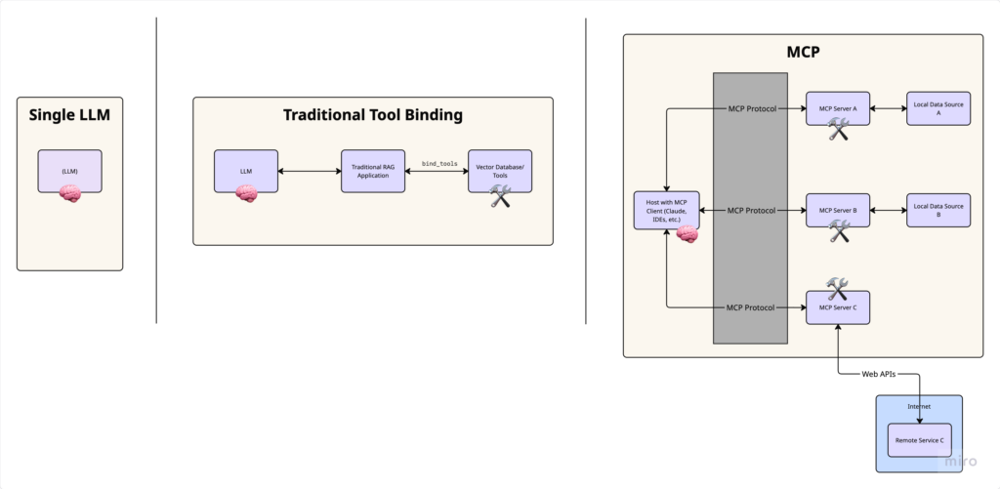</div>

<div>
  <h4>Standalone LLMs:</h4>
  Initially, models like GPT and Claude operated in isolation, relying solely on
  their training data. They couldn’t access real-time information or interact
  with external systems.
  <h4>Tool Binding:</h4>
  As LLMs advanced, developers created methods to “bind” tools directly to
  models. For example, with LangChain or similar frameworks, you could do
  something like:

<div class="">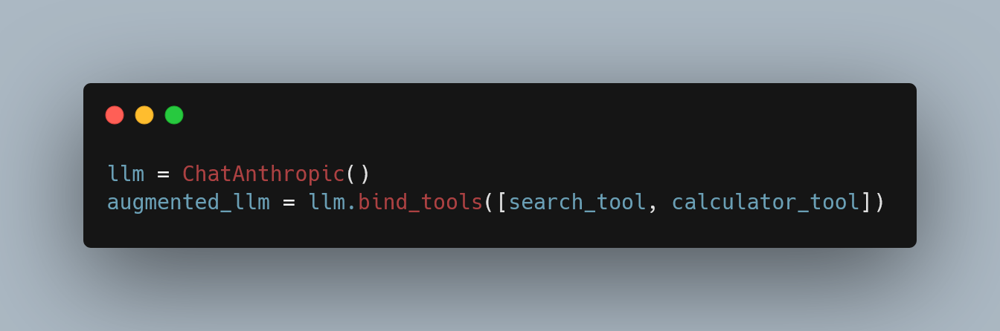</div>

This works well for individual scripts but doesn’t scale easily across applications. Why? Because tool binding in frameworks like LangChain is typically designed around single-session, stateless interactions, meaning every time you spin up a new agent or function call, you’re often re-defining which tools it can access. There’s no centralized way to manage tools across multiple interfaces or user contexts.

<h4>Application Integration Challenge:</h4>

he real complexity arises when you want to integrate tools with AI-powered applications like IDEs (Cursor, VS Code), chat interfaces (Claude Desktop), or other productivity tools. Each application would need custom connectors for every possible tool or data source, creating a tangled web of integrations.

This is where MCP enters the picture — providing a standardized layer of abstraction for connecting AI applications to external tools and data sources.

</div>

## What Is Model Context Protocol (MCP), Really?

    Model: The LLM at the heart of your application — GPT, Claude, whatever. It’s a powerful reasoning engine but limited by what it was trained on and how much context it can hold.

    Context: The extra information your model needs to do its job — documents, search results, user preferences, recent history. Context extends the model’s capabilities beyond its training set.

    Protocol: A standardized way of communicating between components. Think of it as a common language that lets your model interact with tools and data sources in a predictable way.

Much like HTTP enabled the web by standardizing how browsers talk to servers, MCP standardizes how AI applications interact with external data and capabilities.

## Wait, MCP sounds like RAG… but is it?:

“How is this different from RAG?”

At a glance, both MCP and RAG aim to solve the same problem: give language models access to relevant, external information. But how they do it — and how maintainable they are — differs significantly.
Matritsaning umumiy ko‘rinishi:

       ### In an MCP-based setup:

    Your AI app (host/client) connects to an MCP document server

    You interact with context using a standardized protocol

    You can add new documents or tools without modifying the app

    Everything works via the same interface, consistently

<div class="">
  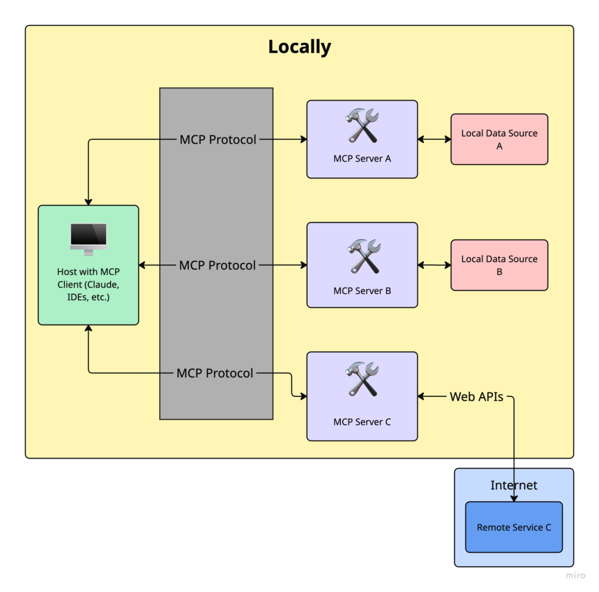
</div>

### In a traditional RAG system

    Your app manually builds and queries a vector database

    You often need custom embedding logic, retrievers, and loaders

    Adding new sources means rewriting part of your app code

    Every integration is bespoke, tightly coupled to your app logic

The key distinction is abstraction: The Protocol in Model Context Protocol is nothing but a standardized abstraction layer that defines bidirectional communication between MCP Client/Host and MCP Servers.

<div class="">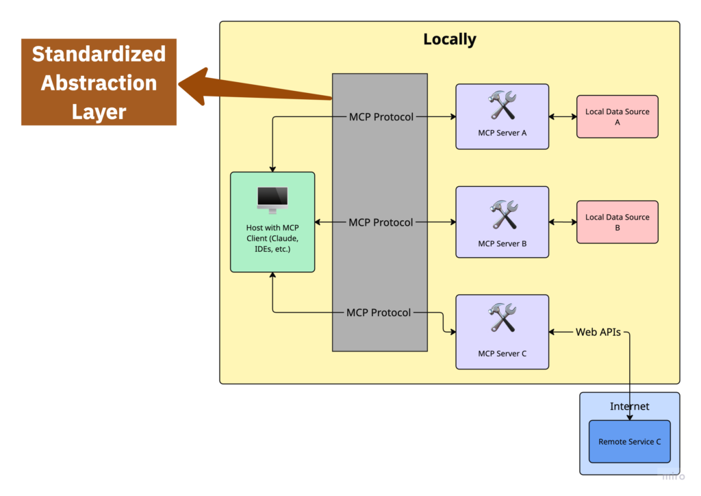</div>
MCP gives your app the ability to ask, “Give me information about X,” without
knowing how that info is stored or retrieved. RAG systems require your app to
manage all of that.

### Traditional RAG Implementation

In a traditional RAG implementation, your application code directly manages connections to document sources:

<div class="">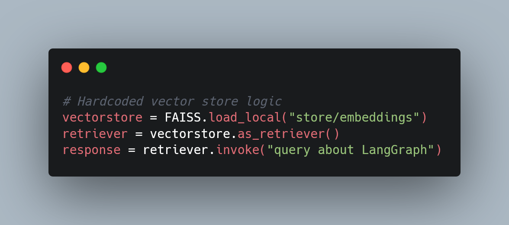</div>

With tool binding, you define tools and bind them to an LLM, but still need to modify the tool implementation to incorporate new data sources. You still need to update the tool implementation when your backend changes.

<div class="">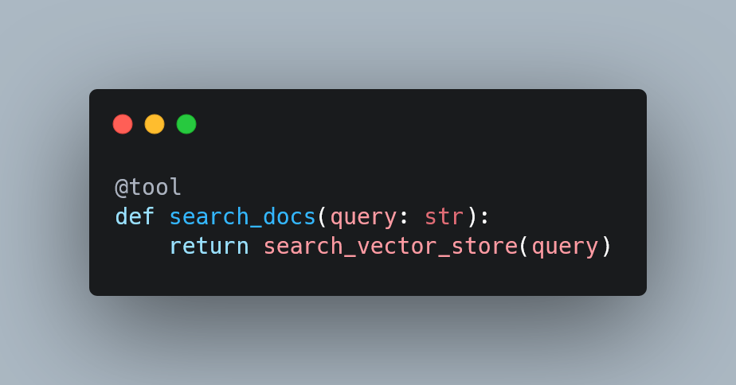</div>

### MCP Implementation

With MCP, your application connects to a standardized interface, and the server handles the specifics of document sources:

<div class="">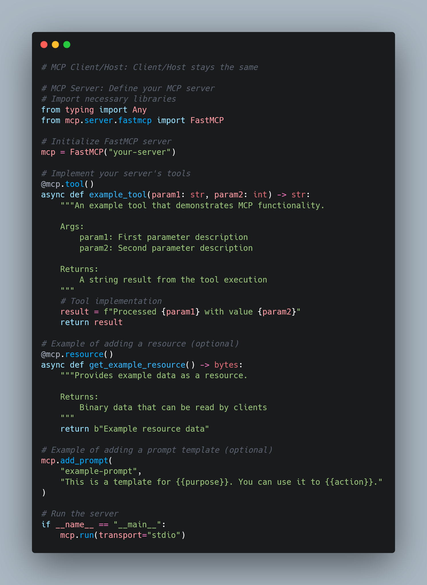</div>

Then, configure the host or client like Claude Desktop to use the server by updating its configuration file.

<div class="">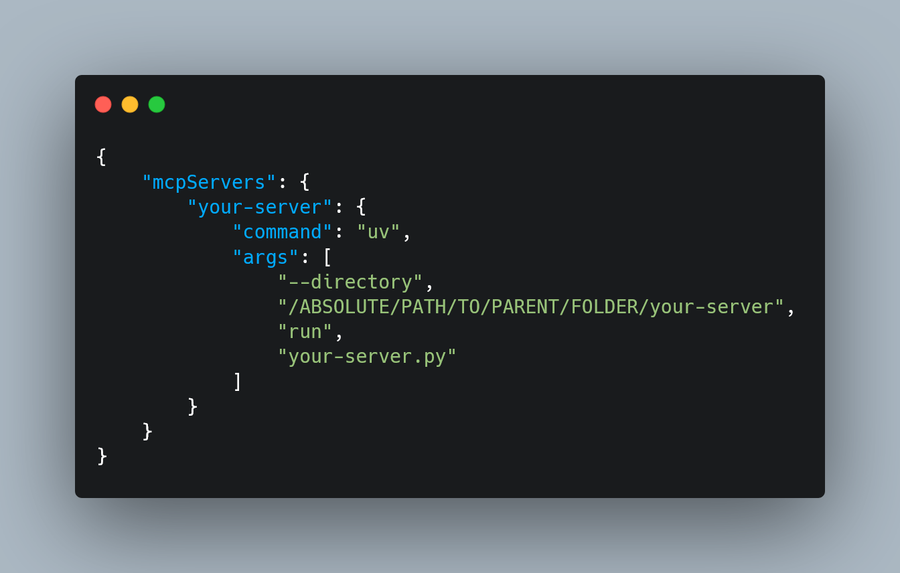</div>

If you change where or how the resources/documents are stored, you update the server — not the client.

That’s the magic of abstraction.

And for many use cases — especially in production environments like IDE extensions or commercial applications — you can’t touch the client code at all. MCP’s decoupling is more than just a nice-to-have: it’s a necessity. It isolates the application code so that only the server-side logic (tools, data sources, or embeddings) needs to evolve. The host application remains untouched. This enables rapid iteration and experimentation without risking regression or violating application constraints.

## Quick recap!

Hopefully, by now, it’s clear why MCP actually matters.

Imagine you’re building an AI assistant that needs to:

    Tap into a knowledge base

    Execute code or scripts

    Keep track of past user conversations

Without MCP, you’re stuck writing custom glue code for every single integration. Sure, it works — until it doesn’t. It’s fragile, messy, and a nightmare to maintain at scale.

MCP fixes this by acting as a universal adapter between your model and the outside world. You can plug in new tools or data sources without rewriting your model logic. That means faster iteration, cleaner code, fewer bugs, and AI applications that are actually modular and maintainable.

And I hope you were paying attention when I said MCP enables bidirectional communication between the host (client) and the server — because this unlocks one of MCP’s most powerful use cases: persistent memory.

Out of the box, LLMs are goldfish. They forget everything unless you manually stuff the entire history into the context window. But with MCP, you can:

    Store and retrieve past interactions

    Keep track of long-term user preferences

    Build assistants that actually “remember” full projects or ongoing sessions

No more clunky prompt-chaining hacks or fragile memory workarounds. MCP gives your model a brain that lasts longer than a single chat.

## Core Capabilities of an MCP Server

With all that in mind, it’s pretty clear: the MCP server is the MVP of the whole protocol.

It’s the central hub that defines the capabilities your model can actually use. There are three main types:

    Resources: Think of these as external data sources — PDFs, APIs, databases. The model can pull them in for context, but it can’t change them. Read-only.

    Tools: These are the actual functions the model can call — run code, search the web, generate summaries, you name it.

    Prompts: Predefined templates that guide the model’s behavior or structure its responses. Like giving it a playbook.

What makes MCP powerful is that all of these are exposed through a single, consistent protocol. That means the model can request, invoke, and incorporate them without needing custom logic for each one. Just plug into the MCP server, and everything’s ready to go.

## Real-World Example: Claude Desktop + MCP (Pre-built Servers)

Out of the box, Anthropic offers a bunch of pre-built MCP servers you can plug into your AI apps — things like Claude Desktop, Cursor, and more. Setup is super quick and painless.

For the full list of available servers, head over to the MCP Servers Repository. It’s your buffet of ready-to-use integrations.

In this section, I’ll walk you through a practical example: extending Claude Desktop so it can read from your computer’s file system, write new files, move them around, and even search through them.

This walkthrough is based on the Quickstart guide from the official docs, but honestly, that guide skips a few key details — especially if you’ve never touched these settings before. So I’m filling in the gaps and sharing the extra tips I picked up along the way to save you the headache.

1. Download Claude Desktop or Check for Updates

First things first — grab Claude Desktop. Choose the version for macOS or Windows (sorry Linux folks))

Follow the installation steps as prompted.

2. Check the Prerequisites

Need Node.js installed on machine to get this running smoothly,just download or check

3. Enable Developer Mode

Open Claude Desktop and click on the “Claude” menu in the top-left corner of your screen. From there, select Help.

On macOS, it should look something like this:

<div class="border [&_img,p]:m-0">
  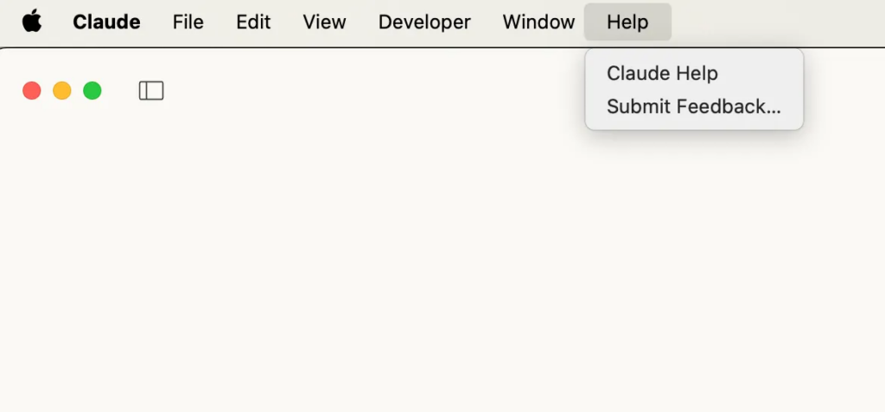
</div>

From the drop-down menu, select “Enable Developer Mode.”

If you’ve already enabled it before, it won’t show up again — but if this is your first time, it should be right there in the list.

Once Developer Mode is turned on:

    1. Click on “Claude” in the top-left menu again.

    2. Select “Settings.”

    3. A new pop-up window will appear — look for the “Developer” tab in the left-hand navigation bar. That’s where all the good stuff lives.

<div class="border [&_img,p]:m-0">
  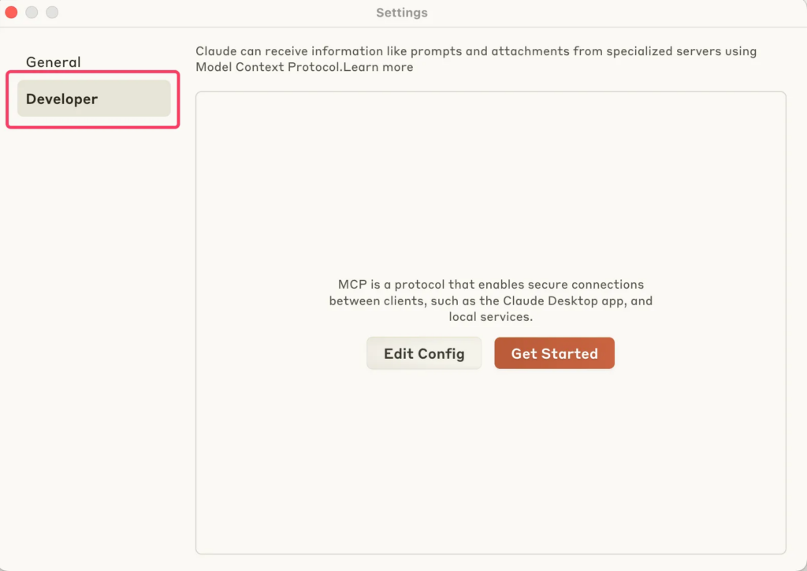
</div>

4. Set Up the Configuration File

Still in the Developer settings, click on “Edit Config.”

This will create a configuration file if one doesn’t already exist and open it directly in your file system.

The file location depends on your OS:

    macOS: ~/Library/Application\ Support/Claude/claude_desktop_config.json


    Windows: %APPDATA%\Claude\claude_desktop_config.json

<div class="border [&_img,p]:m-0">
  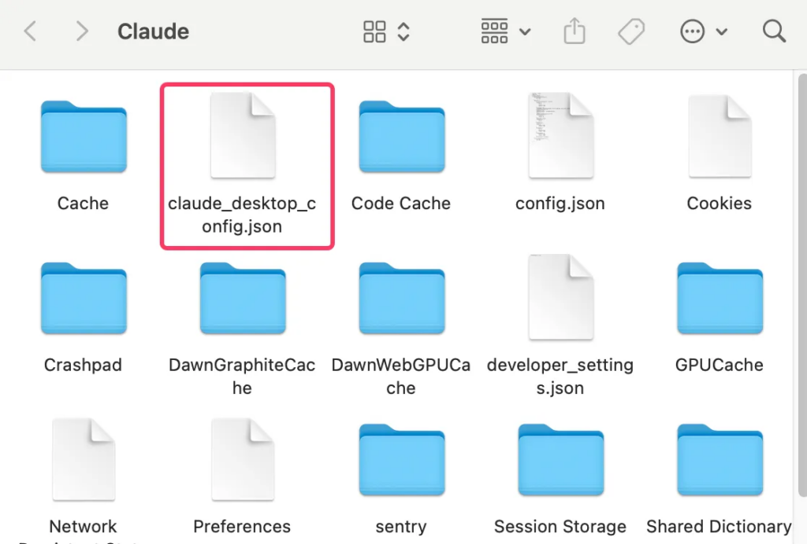
</div>

Open the config file (claude_desktop_config.json) in any text editor. Replace its contents with the following, depending on your OS:

For MacOS:

<div class="">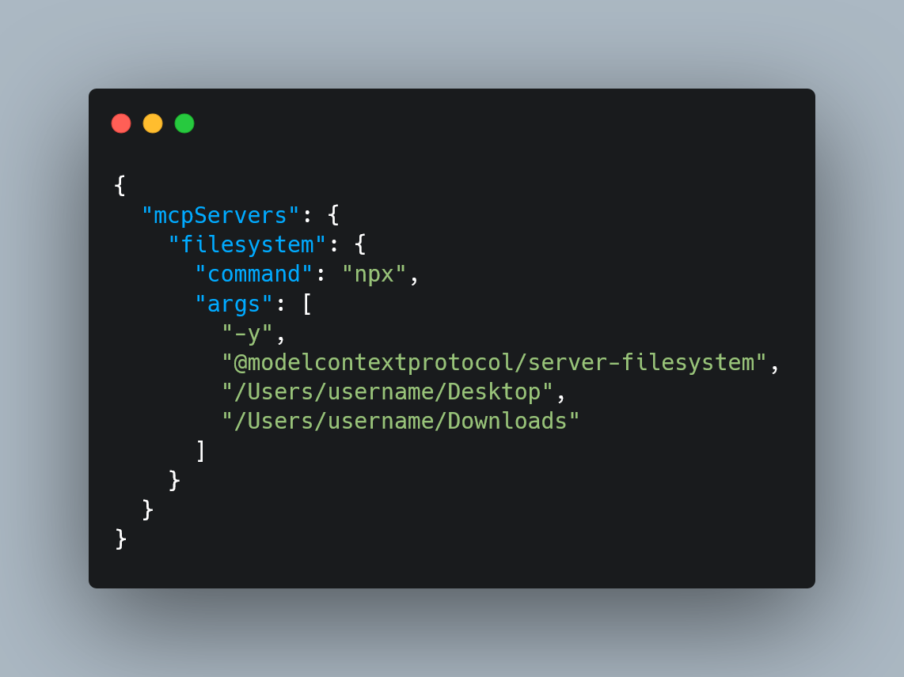</div>
For Windows:
<div class="">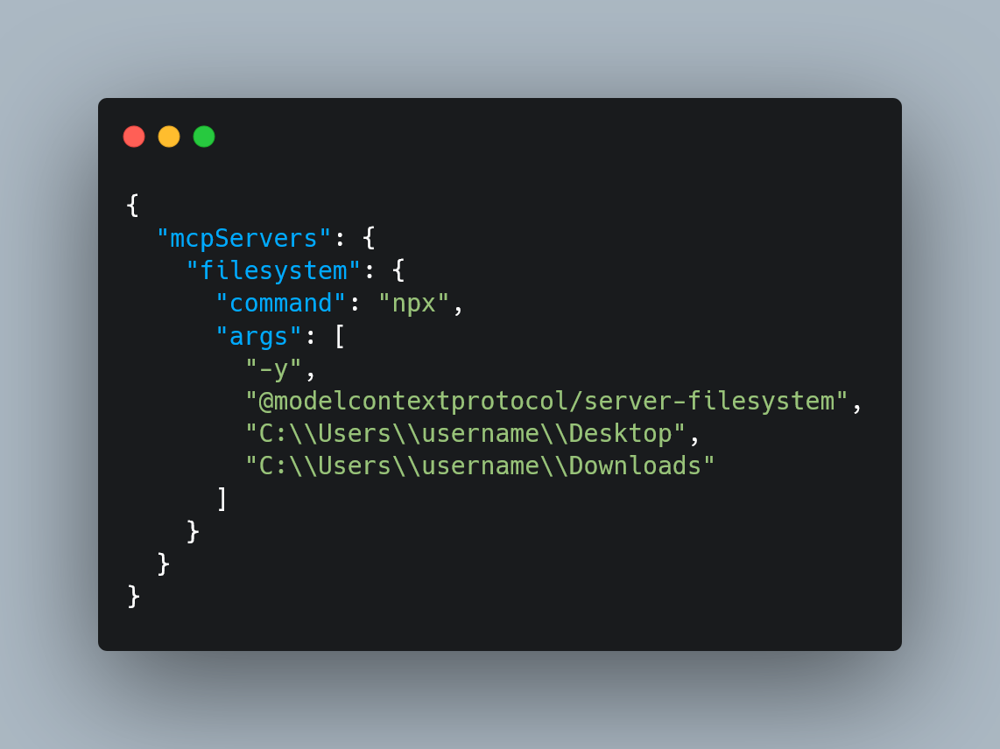</div>
Dont be stupid ass idiot and make sure to replace "username" with your system
username. The paths listed here should point to valid folders on your
machine—this setup gives Claude access to your Desktop and Downloads, but you
can add more paths if needed.

What This Does

This config tells Claude Desktop to automatically start an MCP server called "filesystem" every time the app launches. That server runs using npx and spins up @modelcontextprotocol/server-filesystem, which is what lets Claude interact with your file system—read, write, move files, search directories, etc.

⚠️ Command Privileges

    Just a heads-up: Claude will run these commands with your user account’s permissions, meaning it can access and modify local files. Only add commands to the config file if you understand and trust the server you’re hooking up — no random packages from the internet!

5. Restart Claude

Once you’ve updated and saved your configuration file, restart Claude Desktop to apply the changes.

After it boots up, you should see a hammer icon yeah hummer just fucking hummer in the bottom-left corner of the input box. That’s your signal that the developer tools — and your custom MCP server — are up and running.
After clicking the hammer icon, you should see the list of tools exposed by the Filesystem MCP Server — things like reading files, writing files, searching directories, and so on.

<div class="">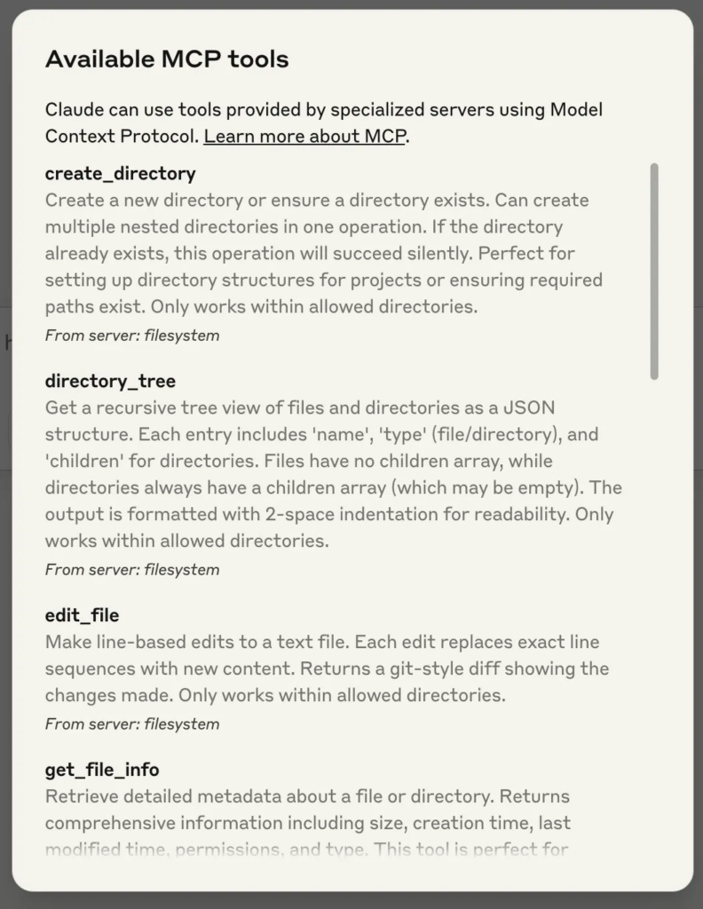</div>
If don’t see your server listed or nothing shows up, don’t worry you just fucked
up.I dont know really what to do in this situation.Jump over to the
Troubleshooting section or do internet research

6. Try It Out!

Now, everything’s set up, can start chatting with Claude about your file system — and it should know when to call the right tools.

## Build Your Own: Custom MCP Server from Scratch

so now lets do something really fucking experience

In this section, We’re going to write a custom MCP server that Claude can talk to — specifically, a tool that lets it search the latest documentation from AI libraries like LangChain, OpenAI, MCP (yes, we’re using MCP to learn MCP), and LlamaIndex.

This tool uses real-time search, scrapes live content, and gives your assistant fresh knowledge on demand. Yes, it’s as cool but this shit took 2 month of my life.
The project is built using the official MCP SDK from Anthropic. If you’re comfortable with Python and the command line, you’ll be up and running in no time. And even if you’re not — don’t worry you just fucked up again.

1. Prerequisites

Before we dive in, here are the things you need installed on your system:

    1. Python 3.10 or higher — this is the programming language we’ll use yes "we"

    2. MCP SDK (v1.2.0 or higher) — this gives  all the tools to create a Claude-compatible server (which will be installed in upcoming parts)

    3. uv (package manager) — think of it like a modern version of pip, but much faster and easier to use for projects (which will be installed in upcoming parts)

Step 1: Install uv (the Package Manager)

If you’ve used Python before, you might be used to pip. uv is like pip’s cooler, more modern cousin. We’ll use it to set up and manage our project. Run the command below in your terminal to install uv:

On macOS/Linux:

```
curl –LsSf https://astral.sh/uv/install.sh | sh

```

On Windows:

```

powershell –ExecutionPolicy ByPass -c "irm https://astral.sh/uv/install.ps1 | iex"
```

This will download and install uv on your machine. Once it’s done, close and reopen your terminal to make sure the uv command is recognized. (If you’re on Windows, you can use WSL or follow their Windows instructions.)

To check that it’s working, run this command in your terminal:

```
uv --version
```

Step 2: Set Up Your Project

Now we’re going to create a folder for our MCP server and get all the pieces in place. In your terminal, run these commands:

```
# Create and enter your project folder
uv init mcp-server
cd mcp-server
# Create a virtual environment
uv venv
# Activate the virtual environment
source .venv/bin/activate  # Windows: .venv\Scripts\activate
```

    1. uv init mcp-server sets up a blank Python project named mcp-server .

    2. uv venv creates a virtual environment (your private sandbox for this project).

    3. source .venv/bin/activate turns on that environment so everything you install stays inside it.

Step 3: Install the Required Packages

Inside virtual environment, install the tools:

```
uv add "mcp[cli]" httpx beautifulsoup4 python-dotenv
```

    1. mcp[cli]: The core SDK that lets you build servers Claude can talk to

    2. httpx: Used to make HTTP requests (like fetching data from websites)

    3. beautifulsoup4: Helps us extract readable text from messy HTML

    4. python-dotenv: Lets us load API keys from a .env file

Step 3.5: Get Your Serper API Key (for Web Search)

To power our real-time documentation search, we’ll use Serper — a simple and fast Google Search API that works great for AI agents.

Here’s how to set it up:

    1. Head over to serper.dev and click Sign Up:
    It’s free for basic usage and works perfectly for this project.
    2. Once signed in, go to your Dashboard:
    You’ll see your API Key listed there. Copy it.
    3. In your project folder, create a file called ```.env:<br>``` This is where we’ll store the key securely (so we’re not hardcoding it).
    4. Add this line to your .env file:

```
SERPER_API_KEY=your-api-key-here

```

Replace `your-api-key-here` with the actual key you copied

That’s it — now your server can talk to Google via Serper and pull in fresh docs when Claude asks.

Step 4: Write the Server Code

Now that your project is set up and your virtual environment is running, it’s time to actually write the server.

This server is going to:

    1. Accept a question like: *“How do I use retrievers in LangChain?”*

    2. Know which documentation site to search (e.g., LangChain, OpenAI, etc.)

    3. Use a web search API (Serper) to find the best links from that site

    4. Visit those pages and scrape the actual content

    5. Return that content to Claude

This is what makes your Claude smarter — it can look things up from real docs instead of making things up based on old data.

⚠️ Quick Reminder About Ethical Scraping

Always respect the site you’re scraping. Use this responsibly. Avoid hitting pages too often, don’t scrape behind login walls, and check the site’s `robots.txt` file to see what’s allowed.

1. Create Your Server File

First, run this from inside your mcp-server folder to create a new file:

```
touch main.py
```

Then open that file in your editor (if it isn’t open already). Replace the code there with the following:

```
from mcp.server.fastmcp import FastMCP
from dotenv import load_dotenv
import httpx
import json
import os
from bs4 import BeautifulSoup
load_dotenv()

mcp = FastMCP("docs")

USER_AGENT = "docs-app/1.0"
SERPER_URL = "https://google.serper.dev/search"

docs_urls = {
    "langchain": "python.langchain.com/docs",
    "llama-index": "docs.llamaindex.ai/en/stable",
    "openai": "platform.openai.com/docs",
    "mcp": "modelcontextprotocol.io"
}

async def search_web(query: str) -> dict | None:
    payload = json.dumps({"q": query, "num": 2})
    headers = {
        "X-API-KEY": os.getenv("SERPER_API_KEY"),
        "Content-Type": "application/json",
    }

    async with httpx.AsyncClient() as client:
        try:
            response = await client.post(
                SERPER_URL, headers=headers, data=payload, timeout=30.0
            )
            response.raise_for_status()
            return response.json()
        except httpx.TimeoutException:
            return {"organic": []}
        except httpx.HTTPStatusError as e:
            print(f"HTTP error occurred: {e}")
            return {"organic": []}

async def fetch_url(url: str) -> str:
    async with httpx.AsyncClient(headers={"User-Agent": USER_AGENT}) as client:
        try:
            response = await client.get(url, timeout=30.0)
            response.raise_for_status()
            soup = BeautifulSoup(response.text, "html.parser")

            # Try to extract main content and remove navigation, sidebars, etc.
            main_content = soup.find("main") or soup.find("article") or soup.find("div", class_="content")

            if main_content:
                text = main_content.get_text(separator="\n", strip=True)
            else:
                text = soup.get_text(separator="\n", strip=True)

            # Limit content length if it's too large
            if len(text) > 8000:
                text = text[:8000] + "... [content truncated]"

            return text
        except httpx.TimeoutException:
            return "Timeout error when fetching the URL"
        except httpx.HTTPStatusError as e:
            return f"HTTP error occurred: {e}"

@mcp.tool()
async def get_docs(query: str, library: str) -> str:
    """
    Search the latest docs for a given query and library.
    Supports langchain, openai, mcp and llama-index.

    Args:
        query: The query to search for (e.g. "Chroma DB")
        library: The library to search in (e.g. "langchain")

    Returns:
        Text from the docs
    """
    if library not in docs_urls:
        raise ValueError(f"Library {library} not supported by this tool. Supported libraries: {', '.join(docs_urls.keys())}")

    query = f"site:{docs_urls[library]} {query}"
    results = await search_web(query)

    if not results or len(results.get("organic", [])) == 0:
        return "No results found"

    combined_text = ""
    for i, result in enumerate(results["organic"]):
        url = result["link"]
        title = result.get("title", "No title")

        # Add separator between results
        if i > 0:
            combined_text += "\n\n" + "="*50 + "\n\n"

        combined_text += f"Source: {title}\nURL: {url}\n\n"
        page_content = await fetch_url(url)
        combined_text += page_content

    return combined_text


if __name__ == "__main__":
    mcp.run(transport="stdio")
```

2. How The Code Works

First, we set up the foundation of our custom MCP server. It pulls in all the libraries you’ll need — like tools for making web requests, cleaning up webpages, and loading secret API keys. It also creates your server and names it "docs" so Claude knows what to call. Then, it lists the documentation sites (like LangChain, OpenAI, MCP, and LlamaIndex) your tool will search through. Finally, it sets the URL for the Serper API, which is what the tool will use to send Google search queries. Think of it as prepping your workspace before actually building the tool.

```
from mcp.server.fastmcp import FastMCP
from dotenv import load_dotenv
import httpx
import json
import os
from bs4 import BeautifulSoup
load_dotenv()

mcp = FastMCP("docs")

USER_AGENT = "docs-app/1.0"
SERPER_URL = "https://google.serper.dev/search"

docs_urls = {
    "langchain": "python.langchain.com/docs",
    "llama-index": "docs.llamaindex.ai/en/stable",
    "openai": "platform.openai.com/docs",
    "mcp": "modelcontextprotocol.io"
}
```

Then, we define a function that lets our tool talk to the Serper API, which we’ll use as a wrapper around Google Search.

This function, search_web, takes in a query string, builds a request, and sends it off to the search engine. It includes your API key for authentication, tells Serper we’re sending JSON, and limits the number of search results to 2 for speed and focus. The function returns a dictionary containing the structured results, and it also gracefully handles timeouts or any errors that might come from the API. This is the part that helps Claude figure out where to look before we even fetch the content.

```
async def search_web(query: str) -> dict | None:
    payload = json.dumps({"q": query, "num": 2})
    headers = {
        "X-API-KEY": os.getenv("SERPER_API_KEY"),
        "Content-Type": "application/json",
    }

    async with httpx.AsyncClient() as client:
        try:
            response = await client.post(
                SERPER_URL, headers=headers, data=payload, timeout=30.0
            )
            response.raise_for_status()
            return response.json()
        except httpx.TimeoutException:
            return {"organic": []}
        except httpx.HTTPStatusError as e:
            print(f"HTTP error occurred: {e}")
            return {"organic": []}
```

Once we’ve found a few promising links, we need a way to extract just the useful content from those web pages. That’s what `fetch_url` does. It visits each URL, grabs the full HTML of the page, and then uses BeautifulSoup to filter out just the readable parts—things like paragraphs, headings, and examples. We try to prioritize sections like `<main>,<article>` or containers with a .content class, which usually hold the good stuff. If the page is super long, we also trim it down to avoid flooding the output. Think of this as the “reader mode” for Claude—it turns cluttered webpages into clean text it can understand.

```
async def fetch_url(url: str) -> str:
    async with httpx.AsyncClient(headers={"User-Agent": USER_AGENT}) as client:
        try:
            response = await client.get(url, timeout=30.0)
            response.raise_for_status()
            soup = BeautifulSoup(response.text, "html.parser")

            # Try to extract main content and remove navigation, sidebars, etc.
            main_content = soup.find("main") or soup.find("article") or soup.find("div", class_="content")

            if main_content:
                text = main_content.get_text(separator="\n", strip=True)
            else:
                text = soup.get_text(separator="\n", strip=True)

            # Limit content length if it's too large
            if len(text) > 8000:
                text = text[:8000] + "... [content truncated]"

            return text
        except httpx.TimeoutException:
            return "Timeout error when fetching the URL"
        except httpx.HTTPStatusError as e:
            return f"HTTP error occurred: {e}"
```

Now comes the main act: the actual tool function that Claude will call.

The get_docs function is where everything comes together. Claude will pass it a query and the name of a library (like "llama-index"), and this function will:

    1. Check if that library is supported

    2. Build a site-specific search query (e.g., site:docs.llamaindex.ai "vector store")

    3. Use search_web() to get the top results

    4. Use fetch_url() to visit and extract the content

    5. Format everything into a nice, readable string that Claude can understand and return

We also include titles, URLs, and some visual separators between each result, so Claude can reference or cite them if needed.

```
@mcp.tool()
async def get_docs(query: str, library: str) -> str:
    """
    Search the latest docs for a given query and library.
    Supports langchain, openai, mcp and llama-index.

    Args:
        query: The query to search for (e.g. "Chroma DB")
        library: The library to search in (e.g. "langchain")

    Returns:
        Text from the docs
    """
    if library not in docs_urls:
        raise ValueError(f"Library {library} not supported by this tool. Supported libraries: {', '.join(docs_urls.keys())}")

    query = f"site:{docs_urls[library]} {query}"
    results = await search_web(query)

    if not results or len(results.get("organic", [])) == 0:
        return "No results found"

    combined_text = ""
    for i, result in enumerate(results["organic"]):
        url = result["link"]
        title = result.get("title", "No title")

        # Add separator between results
        if i > 0:
            combined_text += "\n\n" + "="*50 + "\n\n"

        combined_text += f"Source: {title}\nURL: {url}\n\n"
        page_content = await fetch_url(url)
        combined_text += page_content

    return combined_text
```

Finally, this line kicks everything off. It tells the MCP server to start listening for input from Claude using standard input/output (which is how Claude Desktop talks to external tools). This line always lives at the bottom of your script.

```
if __name__ == "__main__":
    mcp.run(transport="stdio")
```

Step 5: Test and Run Your Server

Alright, your server is coded and ready to go — now let’s run it and see it in action. There are two main ways to test your MCP server:
Development Mode (Recommended for Building & Testing)

The easiest way to test your server during development is to use:

```
mcp dev main.py
```

This command launches the MCP Inspector, which opens up a local web interface in browser. It’s like a control panel for server.

<div class="">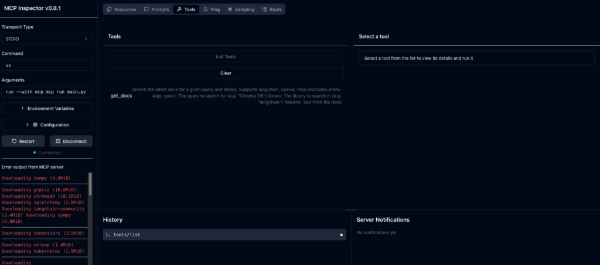</div>
Here’s what we can do with it:

    1. Interactively test your tools (like get_docs)

    2. View detailed logs and error messages in real time

    3. Monitor performance and response times

    4. Set or override environment variables temporarily

Use this mode while building and debugging. You’ll be able to see exactly what Claude would see and quickly fix any issues before integrating with the full Claude Desktop app.

Claude Desktop Integration (For Regular Use)

Once server works,we can install it into Claude Desktop:

```
mcp install main.py
```

This command will:

    1. Add your server into Claude’s configuration file (the JSON file we fiddled with earlier) automatically

    2. Enable it to run every time you launch Claude Desktop

    3. Make it available through the Developer Tools (remember 🔨 hammer icon)

_BUT BUT BUT_

⚠️ Current Issue: uv Command Is Hardcoded

Right now, there’s an open issue in the mcp library: when it writes server into Claude’s config file, it hardcodes the command as just "uv". That works only if uv is globally available in your PATH — which isn’t always the case, especially if you installed it locally with pipx or a custom method.

NEED TO FIX IT BUT HOW?

<h3>Manually Update Claude’s Config File</h3>
1. Open your Claude config file:

On MacOS:

```
code ~/Library/Application\ Support/Claude/claude_desktop_config.json
```

On Windows:

```
code $env:AppData\Claude\claude_desktop_config.json
```

Using VS Code? okay replace code with your text editor of choice (like open, nano, or subl).

2. Find the section that looks like this:

```
"docs": {
  "command": "uv",
  "args": [
    "run",
    "--with",
    "mcp[cli]",
    "mcp",
    "run",
    "/PATH/TO/mcp-server/main.py"
  ]
}
```

3. Update the `command` value to the absolute path of `uv` on your system.

   To find it, run this in your terminal:
   `which uv`

   It’ll return something like:
   `/Users/your_username/.local/bin/uv`

   Now replace `uv` in the config with that full path:

```
"docs": {
  "command": "/Users/your_username/.local/bin/uv",
  "args": [
    "run",
    "--with",
    "mcp[cli]",
    "mcp",
    "run",
    "PATH/TO/mcp-server/main.py"
  ]
}
```

4. Save the file and restart Claude Desktop.

   So that`s all,ALLL. This mfs was real challenge for  my brain
